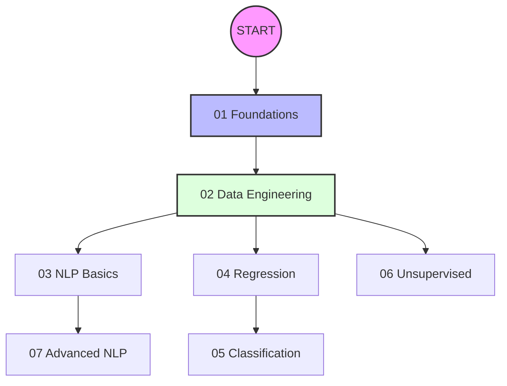

# Machine Learning Fundamentals 🚀

Welcome to the **ML Fundamentals** deep-dive series. This repository is designed to take you from zero to mathematical intuition in Machine Learning, covering everything from basic problem framing to advanced Transformer architectures.

## 🗺️ Learning Roadmap

---

## 📚 Curriculum Overview

### Phase 1: Foundations & Data
*   **[Chapter 1: Foundations](01_Foundations.md)**
    *   *Summary*: Understand how machines learn, ROI framing, and the difference between traditional ML and Deep Learning.
*   **[Chapter 2: Data Engineering](02_Data_Engineering.md)**
    *   *Summary*: Mastering the art of cleaning data, handling outliers, and scaling features for mathematical modeling.

### Phase 2: Supervised Learning
*   **[Chapter 4: Regression](04_Supervised_Learning_Regression.md)**
    *   *Summary*: Deep dive into Linear Regression, Gradient Descent math, and error metrics like MSE and MAE.
*   **[Chapter 5: Classification](05_Supervised_Learning_Classification.md)**
    *   *Summary*: Logistic Regression, SVMs, Decision Trees, and how Ensemble methods (Boosting/Bagging) dominate tabular data.

### Phase 3: Natural Language Processing (NLP)
*   **[Chapter 3: NLP Fundamentals](03_NLP_Fundamentals.md)**
    *   *Summary*: Turning text into math using TF-IDF, Tokenization, and Lemmatization.
*   **[Chapter 7: Advanced Text Modeling](07_Advanced_Text_Modeling.md)**
    *   *Summary*: Exploring the world of Transformers, Attention mechanisms, BERT, and Topic Modeling.

### Phase 4: Finding Patterns
*   **[Chapter 6: Unsupervised Learning](06_Unsupervised_Learning.md)**
    *   *Summary*: Clustering (K-Means/DBSCAN) and Dimensionality Reduction (PCA/t-SNE) for discovery without labels.

---
> [!TIP]
> Each chapter contains **Numerical Intuition Examples** where we step through the math manually to ensure you grasp the logic behind the code.